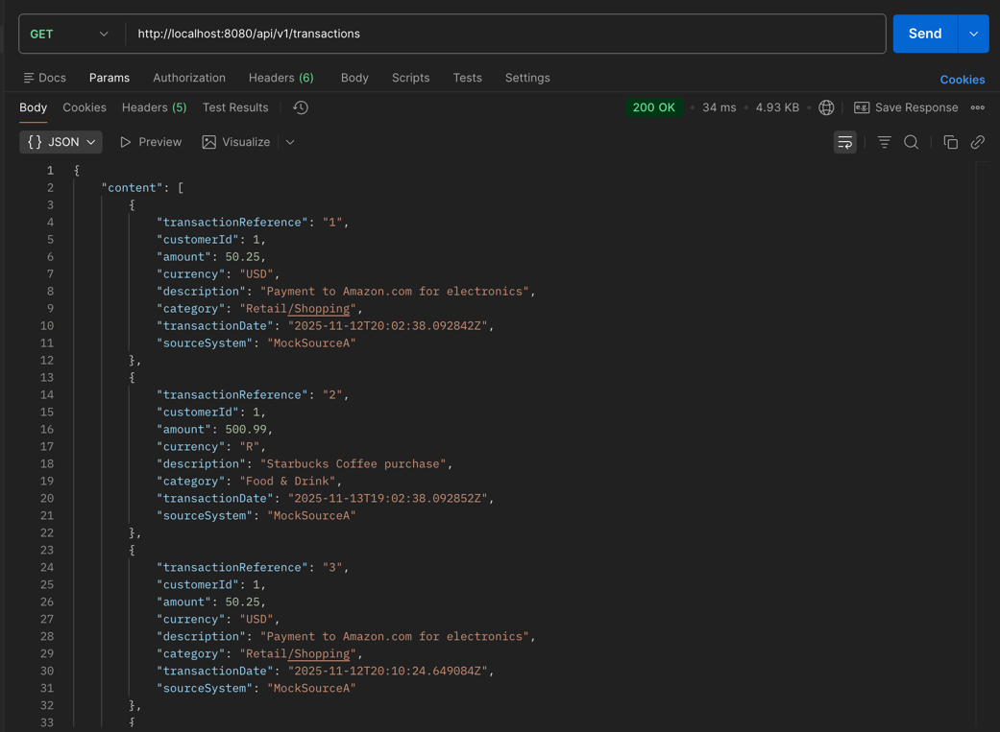
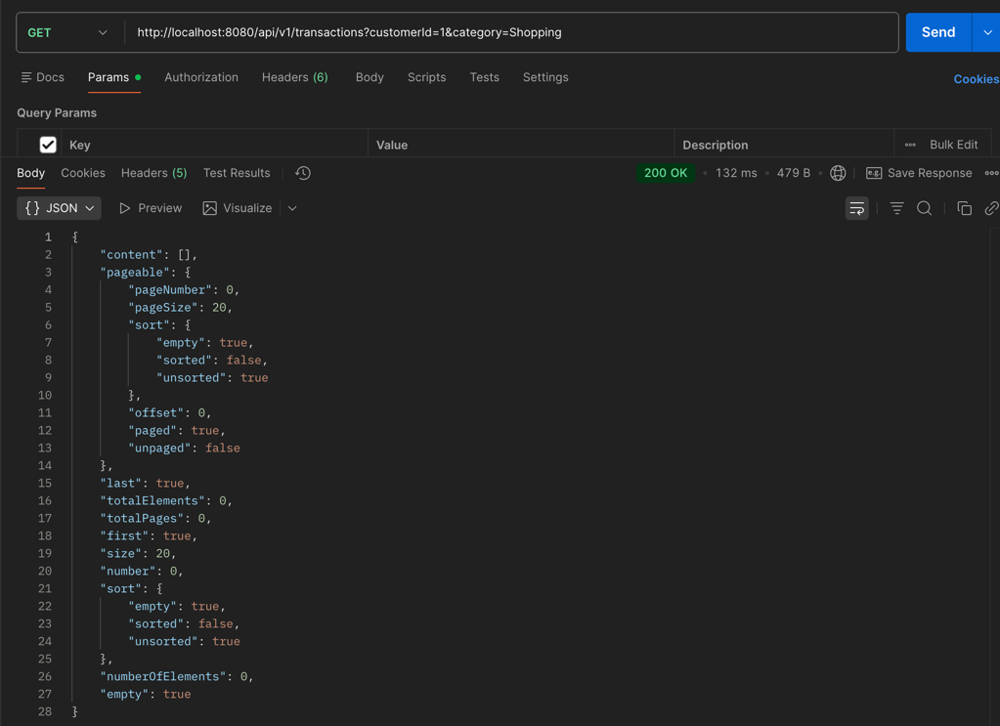
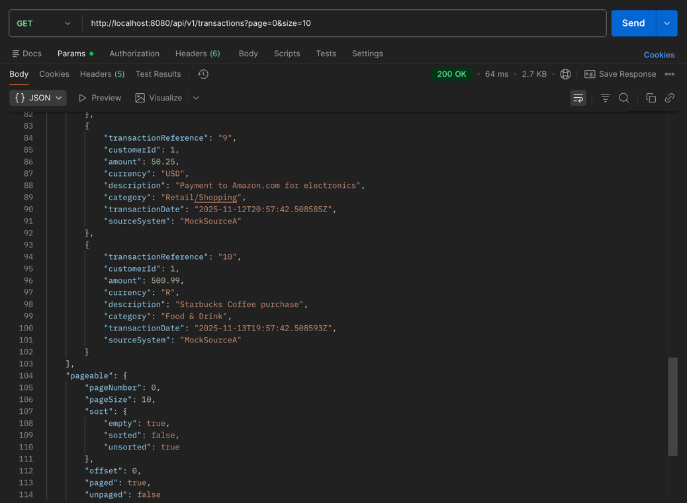
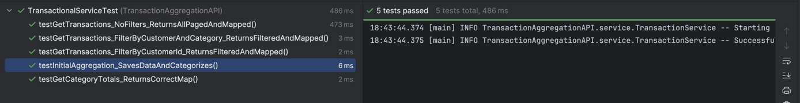

# 1. Transaction Aggregation API

This project implements a production-grade API using Spring Boot, Java 17, and PostgreSQL to aggregate and categorize customer financial transaction data from multiple mock sources.

## Prerequisites

* Java Development Kit (JDK) 17+
* Docker and Docker Compose
* Maven 3+

## 🚀 How to Build and Run the Project

The easiest way to run the entire system (Application + Database) is using Docker Compose.

### Step 1: Clone the Repository

bash
git clone <your-repo-link>
cd <your-project-directory>

### Step 2: Build and Start the Containers
docker-compose up --build -d

### Step 3: Verify the Running Services
docker-compose logs -f aggregation-api

The API will be running at http://localhost:8080.

### How to Test the Project
You can use a tool like cURL or Postman to test the main endpoints.

Postman collection link:

https://.postman.co/workspace/My-Workspace~4fd56fb0-1335-465f-85d6-6591a26b4c61/request/25910475-cf0bebcd-efd7-4d54-b8b0-30a290223c93?action=share&creator=25910475&ctx=documentation

End points (Test Proofs):

 1. http://localhost:8080/api/v1/transactions

   

 2. http://localhost:8080/api/v1/transactions/customer/{customerId}/summary
    

 3. http://localhost:8080/api/v1/transactions?page=0&size=10
    

### Unit Test

### Build by
Michael Lamula